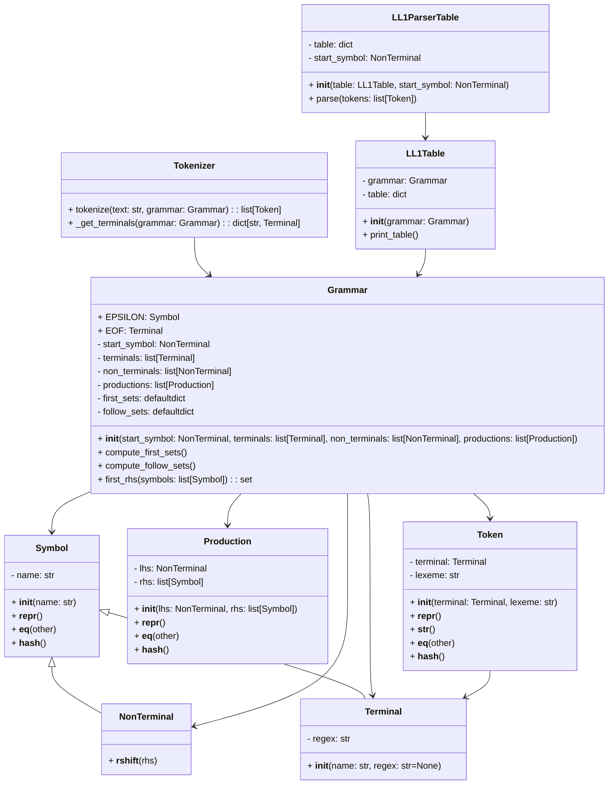

```mermaid
classDiagram
    %% Core Grammar Components
    class Symbol {
        - name: str
        + __init__(name: str)
        + __repr__()
        + __eq__(other)
        + __hash__()
    }
    class NonTerminal {
        + __rshift__(rhs)
    }
    class Terminal {
        - regex: str
        + __init__(name: str, regex: str=None)
    }
    class Production {
        - lhs: NonTerminal
        - rhs: list[Symbol]
        + __init__(lhs: NonTerminal, rhs: list[Symbol])
        + __repr__()
        + __eq__(other)
        + __hash__()
    }

    %% Grammar and Parsing
    class Grammar {
        + EPSILON: Symbol
        + EOF: Terminal
        - start_symbol: NonTerminal
        - terminals: list[Terminal]
        - non_terminals: list[NonTerminal]
        - productions: list[Production]
        - first_sets: defaultdict
        - follow_sets: defaultdict
        + __init__(start_symbol: NonTerminal, terminals: list[Terminal], non_terminals: list[NonTerminal], productions: list[Production])
        + compute_first_sets()
        + compute_follow_sets()
        + first_rhs(symbols: list[Symbol]): set
    }
    class LL1Table {
        - grammar: Grammar
        - table: dict
        + __init__(grammar: Grammar)
        + print_table()
    }
    class LL1ParserTable {
        - table: dict
        - start_symbol: NonTerminal
        + __init__(table: LL1Table, start_symbol: NonTerminal)
        + parse(tokens: list[Token])
    }

    %% Tokenization
    class Token {
        - terminal: Terminal
        - lexeme: str
        + __init__(terminal: Terminal, lexeme: str)
        + __repr__()
        + __str__()
        + __eq__(other)
        + __hash__()
    }
    class Tokenizer {
        + tokenize(text: str, grammar: Grammar): list[Token]
        + _get_terminals(grammar: Grammar): dict[str, Terminal]
    }

    %% Relationships
    Symbol <|-- NonTerminal
    Symbol <|-- Terminal
    Grammar --> Production
    Grammar --> NonTerminal
    Grammar --> Terminal
    Grammar --> Symbol
    Grammar --> Token
    Tokenizer --> Grammar
    Token --> Terminal
    LL1Table --> Grammar
    LL1ParserTable --> LL1Table

    %% Grouping for clarity
    subgraph CoreGrammarComponents
        Symbol
        NonTerminal
        Terminal
        Production
    end

    subgraph Tokenization
        Token
        Tokenizer
    end

    subgraph GrammarAndParsing
        Grammar
        LL1Table
        LL1ParserTable
    end
```